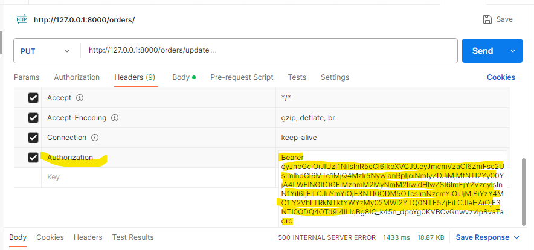

# E-Commerce Backend API

A robust Flask-based e-commerce backend API with comprehensive inventory management, user authentication, order processing, and sales analytics capabilities.

## 📋 Table of Contents

- Features
- Tech Stack
- Project Structure
- Getting Started
- API Endpoints
- Design Choices
- Database Schema
- Authentication
- Contributing

## 🚀 Features

### Core Functionality
- **User Management**: Registration, login, profile updates with JWT authentication
- **Product Management**: CRUD operations for products with category organization
- **Inventory Control**: Real-time stock tracking and quantity management
- **Order Processing**: Complete order lifecycle from creation to execution
- **Sales Analytics**: Comprehensive sales statistics and profit calculations
- **International Shipping**: Country validation for order locations

### Advanced Features
- **Bulk Product Import**: CSV/Excel file processing for product uploads
- **Sales Reporting**: Product performance and category-wise analytics
- **Session Management**: JWT tokens with refresh capability
- **Data Validation**: Pydantic schemas for request/response validation

## 🛠️ Tech Stack

- **Backend Framework**: Flask
- **Database**: PostgreSQL
- **ORM**: SQLAlchemy
- **Authentication**: Flask-JWT-Extended
- **Data Validation**: Pydantic
- **Data Processing**: Pandas (for CSV/Excel imports)
- **Containerization**: Docker & Docker Compose
- **Password Security**: Werkzeug password hashing

## 📁 Project Structure

```
├── src/
│   ├── models/                 # SQLAlchemy database models
│   │   ├── user.py            # User model with authentication
│   │   ├── product.py         # Product model with inventory
│   │   ├── category.py        # Category model for organization
│   │   └── order.py           # Order and OrderItem models
│   │
│   ├── schemas/               # Pydantic validation schemas
│   │   ├── user.py           # User-related schemas
│   │   ├── product.py        # Product schemas
│   │   ├── order.py          # Order schemas
│   │   └── statistics.py     # Analytics schemas
│   │
│   ├── service/db/           # Business logic layer
│   │   ├── user_service.py   # User operations
│   │   ├── product_service.py # Product & inventory management
│   │   ├── category_service.py # Category operations
│   │   ├── order_service.py  # Order processing
│   │   └── statistics.py     # Sales analytics
│   │
│   ├── routes/               # API route handlers
│   │   ├── users.py         # User endpoints
│   │   ├── products.py      # Product endpoints
│   │   ├── orders.py        # Order endpoints
│   │   └── statistics.py    # Analytics endpoints
│   │
│   ├── repository/           # Data access utilities
│   ├── utils/               # Helper utilities
│   ├── database.py          # Database connection setup
│   └── app.py              # Flask application entry point
│
├── docker-compose.yml       # Multi-container orchestration
├── dockerfile              # Backend container definition
├── .env                   # Environment configuration
└── requirements.txt       # Python dependencies
```

## 🏃‍♂️ Getting Started

### Prerequisites
- Docker and Docker Compose
- Python 3.8+ (for local development)
- PostgreSQL (if running locally)

### Environment Setup

1. **Clone the repository**

2. **Create environment file**
   ```bash
   cp .env.example .env
   ```

3. **Configure environment variables in `.env`**
   Because this is a study project, I uploaded my .env file to GitHub to make testing easier.

### Running with Docker (Recommended)

1. **Build and start services**
   ```bash
   docker-compose up --build
   ```

2. **The API will be available at:**
   - Backend: `http://localhost:5000`
   - Database: `localhost:5432`

3. **To run in detached mode:** (recommended)
   ```bash
   docker-compose up -d --build
   ```

\
### Database Initialization

The application automatically creates tables on first run. To populate with sample data:

1. **Create categories first** (via API or directly in database)
2. **Import products** using the bulk import endpoints
3. you will need to use the app routs and register a user to test the app.

## 🔗 API Endpoints

### Authentication
- `POST /users/add` - User registration
- `POST /users/login` - User login
- `POST /users/refresh` - Refresh access token
- `POST /users/logout` - User logout
- `PUT /users/update` - Update user profile
- `DELETE /users/delete` - Delete user account

### Product Management
- `GET /products` - List all products
- `POST /products/add` - Add single product
- `POST /products/bulk-import` - Import products from CSV/Excel
- `PUT /products/update` - Update product details
- `DELETE /products/remove` - Remove product

### Category Management
- `GET /categories` - List all categories
- `GET /categories/products` - Get products by category
- `PUT /categories/update` - Update category name
- `DELETE /categories/delete` - Delete category

### Order Processing
- `POST /orders/create` - Create new order
- `GET /orders/user` - Get user's orders
- `POST /orders/execute` - Execute order (process payment & inventory)
- `PUT /orders/update` - Update order items
- `DELETE /orders/delete` - Cancel order

### Analytics & Statistics
- `GET /statistics/profit` - Total profit and executed orders count
- `GET /statistics/product-sales` - Product sales percentages
- `GET /statistics/category-product-sales` - Category-wise sales breakdown

## 🏗️ Design Choices

### Architecture Patterns

#### **Layered Architecture**
The application follows a clean layered architecture:
- **Routes Layer**: HTTP request handling and response formatting
- **Service Layer**: Business logic and domain operations
- **Model Layer**: Data models and database interactions
- **Schema Layer**: Data validation and serialization

#### **Separation of Concerns**
Each component has a single responsibility:
- Models define database structure
- Services handle business logic
- Schemas validate data
- Routes manage HTTP interactions


### Authentication Strategy

#### **JWT Token Approach**
- **Access Tokens**: Short-lived (15 minutes) for API access
- **Refresh Tokens**: Long-lived (30 days) for token renewal
- **Secure Storage**: Tokens should be stored in httpOnly cookies (frontend responsibility)

#### **Security Measures**
- Password hashing with Werkzeug's secure methods
- Token revocation capability for logout
- Protected routes with `@jwt_required()` decorator

### Data Processing

#### **Bulk Import Strategy**
- Pandas for efficient CSV/Excel processing
- Batch database operations for performance
- Error handling with transaction rollback
- Validation at both schema and business logic levels

#### **Error Handling Philosophy**
- Fail fast with descriptive error messages
- Graceful degradation for non-critical operations
- Transaction safety with rollback on failures

### Scalability Considerations

#### **Database Optimization**
- Foreign key relationships for data integrity
- Indexed columns for common queries
- Pagination support (easily extensible)

#### **Service Layer Benefits**
- Easy to extract into microservices
- Testable business logic
- Reusable across different interfaces (REST, GraphQL, etc.)

## 🗄️ Database Schema

### Core Tables

#### Users
- **Purpose**: Customer and admin account management
- **Key Fields**: `email` (unique), `password_hash`, `full_name`
- **Relationships**: One-to-many with Orders

#### Categories
- **Purpose**: Product organization and filtering
- **Key Fields**: `name` (unique)
- **Relationships**: One-to-many with Products
- **Cascade**: Deleting category deletes associated products

#### Products
- **Purpose**: Inventory and catalog management
- **Key Fields**: `name` (unique), `quantity`, `price`, `category_id`
- **Business Rules**: Quantity ≥ 0, Price > 0

#### Orders
- **Purpose**: Purchase transaction management
- **Key Fields**: `user_id`, `executed` (boolean), `location`
- **Relationships**: Many-to-many with Products through OrderItems

#### OrderItems
- **Purpose**: Order line items with pricing snapshot
- **Key Fields**: `order_id`, `product_id`, `quantity`, `unit_price`
- **Design**: Composite primary key prevents duplicates

## 🔐 Authentication
- **to test routs that are protected with `@jwt_required()` follow those steps: (use postman)**
- use the user routs to create your own app user ( instructions in docu of the user routs ).
- use the login rout to log into the app, you will receive an access token - copy it.
- now to test a `@jwt_required()` required rout , add in the header keys of the request the field "Authentication",
and in the value add "Bearer <your access token>"
- example : 
- 
- then, in the body of the request add the needed json for the chosen rout.
- this will show the rout that youre a logged-in user and allow you to test the `@jwt_required()` 
protected routs.


for future improvement, I need to add "roll" for user table, then only user with roll admin will have access to 
routs that related to storage - for example changing a category name should only
be allowed to admin user and not to a customer type user.


